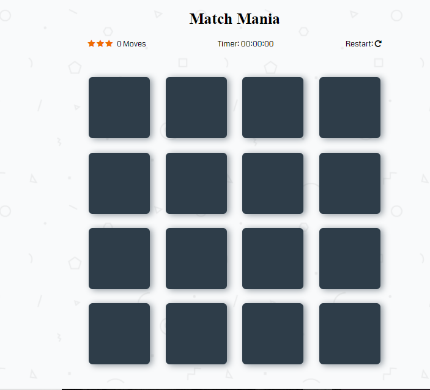
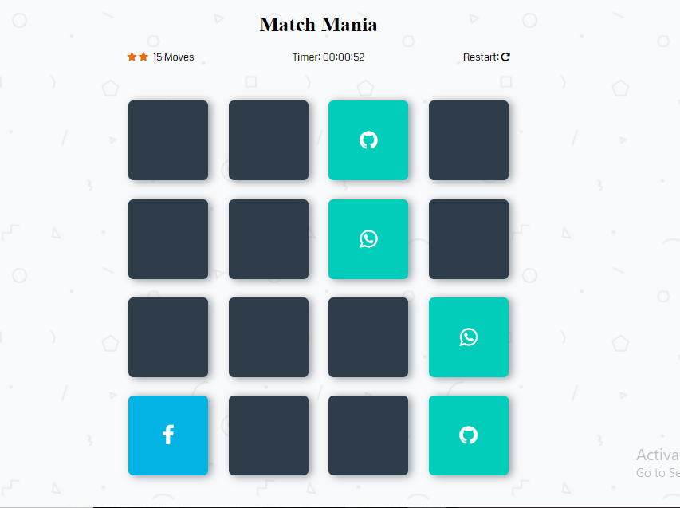

# Match Mania

This is a browser-based card matching game build using HTML,CSS,Javascript and JQuery.This project was build as a part of Udacity FrontEnd Nanodegree program.
Click [here](https://sakshianand.github.io/Memory-Match/) to view the Project Live
## How to Play

The game board consists of sixteen "cards" arranged in a grid. The deck is made up of eight different pairs of cards, each with different symbols on one side. The cards are arranged randomly on the grid with the symbol face down. The gameplay rules are very simple: flip over two hidden cards at a time to locate the ones that match!

Each turn:

 * The player flips one card over to reveal its underlying symbol.
 * The player then turns over a second card, trying to find the corresponding card with the same symbol.
 * If the cards match, both cards stay flipped over.
 * If the cards do not match, both cards are flipped face down.
 * The game ends once all cards have been correctly matched.

## Special Features

 * When the player starts the game timer starts till the game ends
 * Player can Restart the game any time in between
 * Moves are updated Dynamically
 * Depending on the number of moves the player will get a star rating from 1-3 (3 is the best)
 * After the game Ends Congratulation Modal pops up showing Number of Moves taken,Time Taken,Stars Rating and best moves.
 * In the same browser if the player completes the game in minimum number of Moves,Its value is updated  and the best move value is displayed on the Congratulations Page.

 ## Screenshots

 ## Technologies Used

 * HTML5
 * CSS3
 * Javascript
 * JQuery 3.3.1

 ## External Libraries/Plugins Used
 * [Animate.css](https://daneden.github.io/animate.css/)
 * [AnimateModal.js](http://joaopereirawd.github.io/animatedModal.js/)
 * [FontAwesome.js](https://fontawesome.com/)

